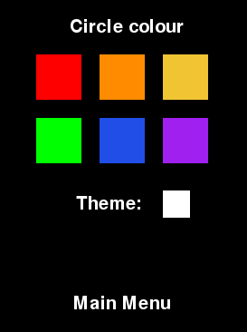
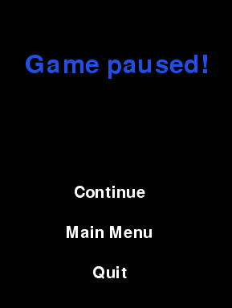

# Reaction-Game

Basic game that randomly spawns a circle which requires it to be clicked quickly

## Setup
Requires Python 3 and Pygame

Installing pygame
    Pygame by going to the [pygame website](http://www.pygame.org/download.shtml) or can b
    e installed with pip 
<pre><code>pip install pygame</code></pre>

Clone this repo
    <pre><code>git clone https://github.com/James-Guo/Reaction-Game.git</code></pre>

Run the code

## Features
- Arcade mode
- Survival mode
- Change circle colours

- Saves highscores
- Ability to pause

## Future ideas
- Chase mode
- Maybe add multiple circles
- Dark mode
